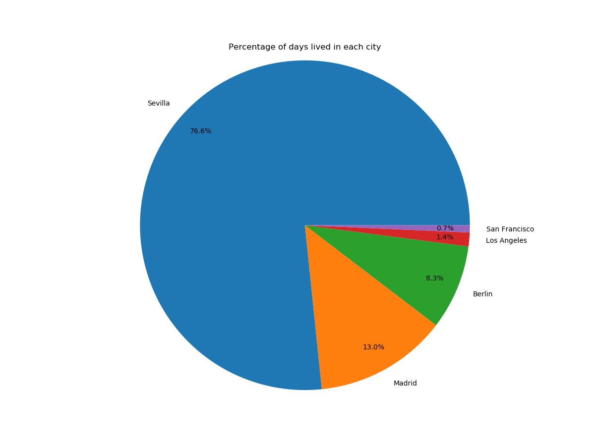

# Homepy
This python script calculates how many days you have lived in different places and plots them as a bar graph or pie chart.




## Setup
Install the dependencies with:
```
pip install -r requirements.txt
```
Example of how to run the script. For more info use argument -h:
```
python3 home.py examples/example_data1.csv city
```
 