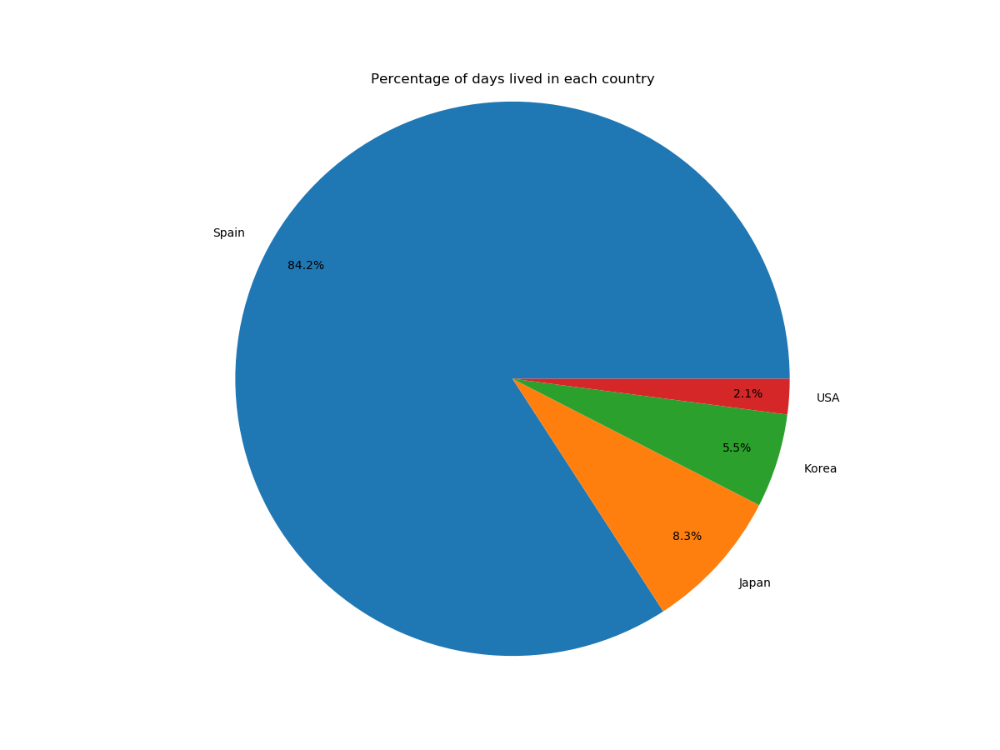

# Homepy
This python script calculates how many days you have lived in different places and plots them as a bar graph or pie chart. It can plot the data with varying spatial resolution. These can for example be; continent, country, state, region, city, street, address. These can be specified in the first row of the csv file. Check the files under `./examples` for example data files.

The script require data in a csv format with labels as the first column. It also requires the start date in the first column and the end date in the second column and that each line has the same number of columns. The script also require the date format YYYY-MM-DD. The rest of the columns can have whatever labels you want and how many want, i.e the csv file can have any number of columns but a minimum of 3.

The date format as well as the column positions of the end and start date can easily be changed in `config.py` if necessary.

## Example output

### Example 1
The output from the script can have the following appearance. These images are created with data from `examples/example_data1.csv`.


Pie chart with the percentage of days spent in the different cities.


Bar graph of the same data as above.


Bar graph showing the number of days instead of percentage.

### Example 2
These images are genererated with the `examples/example_data2.csv` file and illustrates grouping on different labels. The 


Pie chart showing the percentage of days living on three different continents



Pie chart showing the percentage of days living in 5 different countries


Pie chart showing the percentage of days living in 7 different cities

## Setup
Install the dependencies with:
```
pip install -r requirements.txt
```
Example of how to run the script. For more info use argument -h:
```
python3 home.py examples/example_data1.csv city
```
 